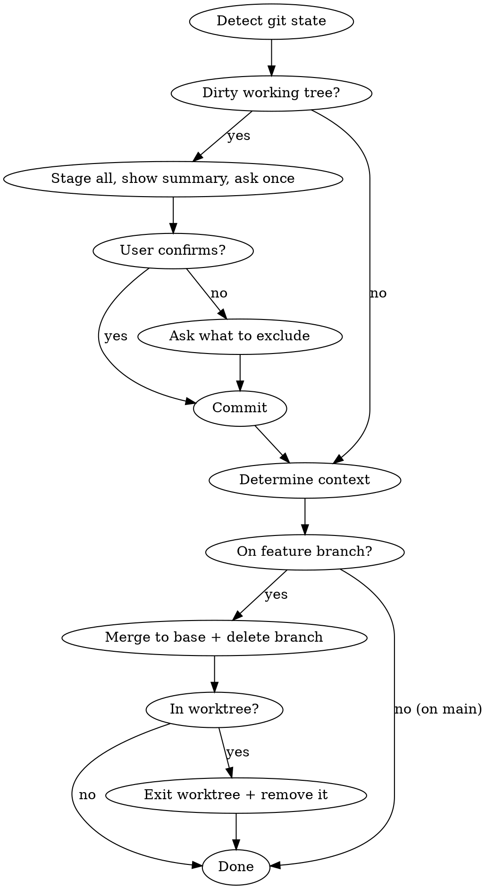

# Accepting Work

## Overview

Handle the post-acceptance workflow: commit any loose files, merge to base branch, clean up worktrees/branches, and leave the repo ready for the next task.

**Core principle:** The user said "looks good" — wrap it up with minimal interruption.

## The Process



### Step 1: Handle Dirty Working Tree

Check for uncommitted or untracked files:

```bash
git status --short
```

**If clean:** Skip to Step 2.

**If dirty:**
1. Stage everything: `git add -A`
2. Show the user a summary of what's staged: `git diff --cached --stat`
3. Ask once: "These files will be committed — OK?"

If the user says no, ask what to exclude, unstage those, then commit the rest.

Commit message: Write a concise message describing what the uncommitted changes are (e.g., "Add auth utility and test coverage for login flow"). Don't use generic messages like "final changes" or "cleanup".

### Step 2: Determine Context

Detect which situation we're in:

```bash
# What branch are we on?
current=$(git branch --show-current)

# Are we in a worktree?
is_worktree=$(git rev-parse --git-common-dir 2>/dev/null)
main_gitdir=$(git rev-parse --git-dir 2>/dev/null)
# If git-common-dir != git-dir, we're in a worktree

# What's the base branch?
base=$(git show-ref --verify refs/heads/main >/dev/null 2>&1 && echo main || echo master)
```

Three possible states:

| State | current branch | worktree? | Action |
|-------|---------------|-----------|--------|
| Working on main | main/master | no | Nothing to merge — done |
| Feature branch | not main | no | Merge to base, delete branch |
| Worktree | not main | yes | Merge to base, delete branch, remove worktree |

### Step 3: Merge (if on feature branch)

```bash
# Get the repo root (for worktree case, this is the main worktree)
repo_root=$(git worktree list | head -1 | awk '{print $1}')

# Switch to base branch in main worktree
cd "$repo_root"
git checkout "$base"
git merge "$current"
```

**If merge conflict:** Stop and tell the user. Don't force it.

### Step 4: Clean Up Branch

After successful merge:

```bash
git branch -d "$current"
```

### Step 5: Clean Up Worktree (if applicable)

If we were in a worktree:

```bash
# We already cd'd to repo_root in Step 3
git worktree remove "$worktree_path"
```

Report: "Merged `<branch>` → `<base>`, removed worktree. Ready for next task."

### Step 6: Report

Keep it brief:

- **Was on main:** "Committed. Ready for next task."
- **Feature branch:** "Merged `<branch>` → `<base>`. Ready for next task."
- **Worktree:** "Merged `<branch>` → `<base>`, cleaned up worktree. Ready for next task."

## Common Mistakes

**Running tests again**
The user already accepted the work. Don't re-run the test suite unless something went wrong during merge.

**Asking too many questions**
The user said "looks good." The only question is the dirty-file confirmation. Don't re-present merge/PR/discard options — they said merge.

**Forgetting to cd back**
After worktree removal, make sure you're in the main repo root, not a deleted directory.

**Force-deleting branches**
Use `git branch -d` (not `-D`). If it fails, the branch wasn't fully merged — something went wrong. Stop and investigate.

## Red Flags

- Merge conflict → Stop, report, let user decide
- `git branch -d` fails → Branch not fully merged, investigate
- Worktree has changes in other branches → Don't touch them
- User says "no" to staged files → Ask what to exclude, don't abort entirely
